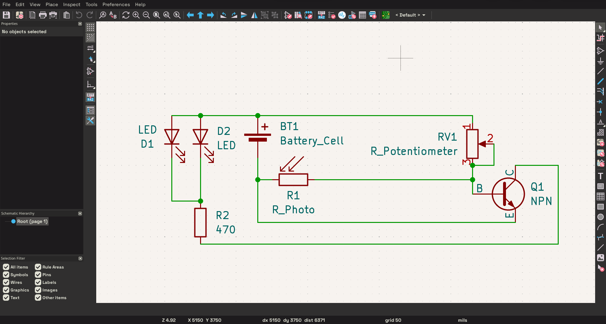
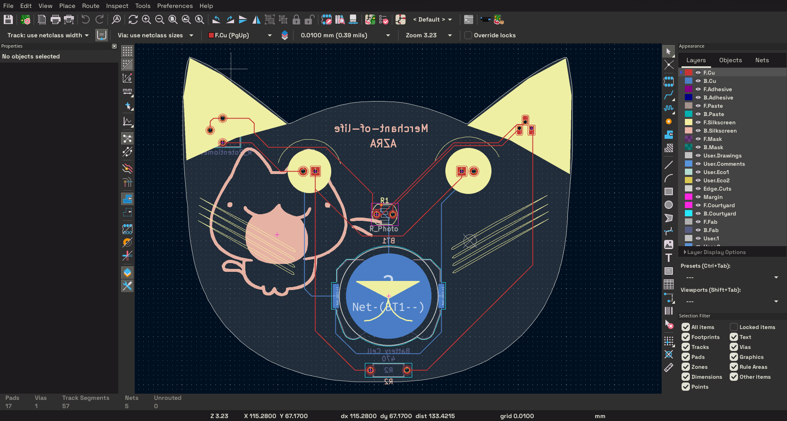
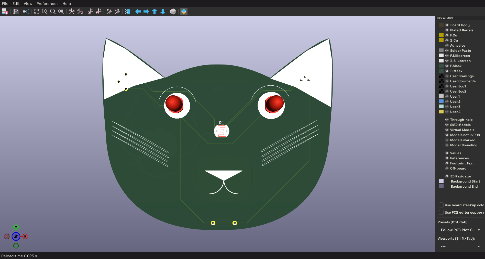
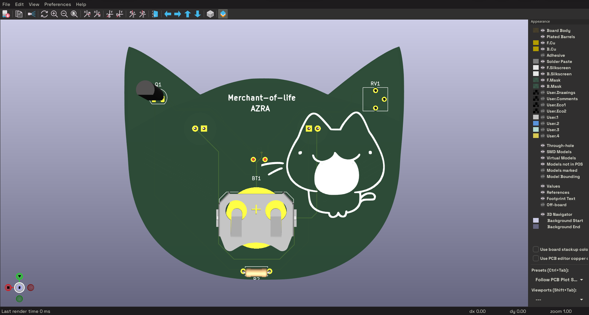

# Solder

A light-sensitive circuit using a photoresistor, an NPN transistor, and two LEDs. Powered by a 20mm coin cell battery.

## Schematic

## PCB

## Features

* Light-sensitive LED activation using a photoresistor
* Adjustable sensitivity via an onboard potentiometer
* Powered by a 20mm coin cell battery
* Easy to solder through-hole (THT) components

## BOM

* 1x 20mm Coin Cell Battery Holder (Keystone 3034 SMD)
* 2x 5mm LEDs
* 1x NPN Transistor (TO-92L)
* 1x Photoresistor (LDR 5.1x4.3mm)
* 1x 470Ω Resistor
* 1x Trim Potentiometer (Vishay T73YP)

Made by @Merchant-Of-Life on Slack :D

Made as a part of http://solder.hackclub.com/
